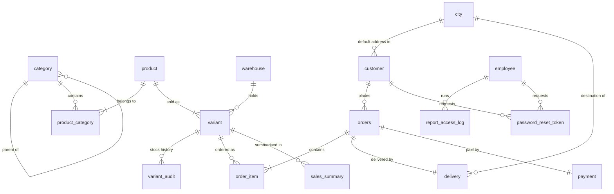

# BrightBuy database

MySQL 8.0, InnoDB, `utf8mb4`. Everything is plain SQL: 19 tables, 1 view, 32 stored
procedures, 5 functions, 18 triggers and 2 roles. No ORM and no migration tool creates
or changes anything. Column details are in [DATA_DICTIONARY.md](DATA_DICTIONARY.md).

## Folders

Each module's scripts are numbered in the order they run inside that module.

| Folder | Owner | Tables | Scripts |
|---|---|---|---|
| `Catalogue/` | Mihisara LHK | category, product, product_category | 01 tables and hierarchy triggers, 02 seed, 03 variant seed, 04 storefront procedures, 05 maintenance procedures |
| `Inventory/` | Nirmal U.K.N | city, warehouse, variant, variant_audit | 01 tables, 02 delivery functions, stock triggers and procedures, 03 seed |
| `Auth/` | Atapattu D.M. | customer, employee, login_attempts, password_reset_token | 01 tables, 02 procedures, 03 seed |
| `Checkout/` | Adeesha W.G.I. | orders, order_item, delivery, payment | 01 tables, 02 procedures, 03 seed |
| `Reporting/` | Senadheera S.D.A.P | sales_summary, report_access_log | 01 tables, 02 procedures |
| `Shared/` | whole team | email_outbox, audit_log | 01 email outbox, 02 audit log, 03 roles, 04 upgrade, 05 release checks |
| `Tests/` | whole team | | seven test suites, index evidence, load data |

## Install and upgrade

`install_all.sh` runs the scripts in dependency order and stops at the first error.

```bash
bash Database/install_all.sh --docker CONTAINER_NAME
```

A **fresh install** creates the tables, loads the sample data (40 products in 10 categories,
48 variants, 4 cities, sample customers and orders), then the routines, audit triggers and
roles, and finishes with the release checks. It refuses a database that already has tables,
and it only accepts a database on this computer (`--docker` or `--local`).

```bash
bash Database/install_all.sh --upgrade --docker CONTAINER_NAME
```

An **upgrade** is for a database that already holds data. It adds missing columns, indexes
and constraints, replaces the routines and triggers, and runs the release checks. It loads
no sample data, deletes no customer, order, product or stock row, and running it twice changes nothing. The shared server
is upgraded with `--upgrade --remote`; see [Docs/OPERATIONS.md](../Docs/OPERATIONS.md).

The order within a fresh install is: tables (Catalogue, Inventory, Shared email, Auth,
Checkout, Reporting), then seeds, then routines, then the audit log triggers, then roles.
The audit triggers come after the seeds on purpose, so the audit log records real
maintenance only.

## Entity relationships



`audit_log`, `login_attempts` and `email_outbox` are logs. They name the row or person
they are about without a foreign key, so a log entry never blocks a change and is never
removed with one.

## How the rules are enforced

| Requirement | Where it is enforced |
|---|---|
| Two-level category hierarchy (AS-1) | Triggers `trg_category_two_levels_insert/update` and `trg_category_not_own_parent_insert` |
| A product has at least one category (BR-2) | `sp_catalogue_create_product` creates the first one; `sp_catalogue_unassign_category` refuses to remove the last |
| A product has at least one variant (BR-3) | `sp_catalogue_create_product` creates product, category and default variant in one transaction |
| Price and stock belong to the variant (BR-4) | Columns of `variant`; `product` has neither |
| Unique SKU per product (BR-5) | Unique index `uq_product_sku` |
| Stock decremented atomically with the order (BR-6, CON-3, SAF-1) | `ProcessCheckout`: one transaction, `SELECT ... FOR UPDATE` on the variants in a fixed order, full rollback on any failure |
| Out of stock at the time of order (project brief) | `ProcessCheckout` takes what is in stock, records the rest in `order_item.backordered_quantity`, and adds the 3-day delay. See "Assumptions" for how this replaces SRS BR-7 and SAF-3 |
| One central warehouse holds all stock (AS-13) | `warehouse` holds one row; a variant created without a warehouse goes to it; a release check blocks a second warehouse |
| Delivery estimate 5 or 7 days, plus 3 if out of stock (BR-8) | Function `fn_delivery_days`. `ProcessCheckout` passes "out of stock" when any line asks for more than the locked stock; `fn_delivery_preview_date` applies the same test before ordering |
| An order has at least one item (BR-9) | `sp_checkout_validate_cart` rejects an empty cart; `order_item.quantity > 0` |
| Stock never below zero (BR-10, CON-4, SAF-2) | `CHECK (stock_quantity >= 0)` on `variant` |
| Pickup has no delivery estimate (BR-11) | `ProcessCheckout` stores no city and no date for pickup |
| Card authorised before confirmation (BR-12, AS-8) | The backend authorises the exact amount from `sp_checkout_quote`; `ProcessCheckout` refuses a card order without a token or with a different amount (`AUTHORISED_AMOUNT_MISMATCH`) |
| Price at time of purchase (BR-13) | `order_item.unit_price`, copied from the locked variant row |
| Only warehouse staff maintain the catalogue and stock (BR-14) | Backend role check per request, re-read from the database by `fn_employee_has_role` |
| Reports are for management and read-only (BR-15) | Backend role check; report procedures only read, and log each run in `report_access_log` |
| Customers see only their own data (BR-16, SEC-6) | Every customer query is filtered by the signed-in customer ID from the session |
| Order history survives catalogue maintenance (BR-18, SAF-6) | `ON DELETE RESTRICT` from `order_item` to `variant` and from `variant` to `product`; products are retired with `is_active`, never deleted |
| Card numbers are never stored (CON-5, SEC-2) | `payment` has only token, reference, type and last four digits; `chk_payment_card_last_four` allows exactly four digits |
| Indexes on foreign keys and report filters (CON-6) | See "Indexes" below |
| Passwords stored as salted hashes (SEC-1) | The backend hashes with BCrypt; the database only ever receives the hash |
| Least-privilege database account (SEC-7) | Role `brightbuy_application`, see "Roles" below |
| Generic sign-in failures and rate limit (SEC-8) | `login_attempts` and `fn_recent_failures`: 5 failures in 15 minutes block the email |
| Audit of staff and administrator actions (SEC-11) | Triggers write `audit_log`; stock changes write `variant_audit` (SAF-7) |
| Email failure never undoes an order (DEP-2, SAF-8) | Messages are queued after the order commits, inside a block that ignores queue errors |

The backend tells the database who is acting by setting the session variable
`@brightbuy_actor` (`employee:7`, `customer:12`) before a change. The audit triggers store
that value, or the MySQL account when it is not set.

## Stored procedures and functions

| Module | Routine | Purpose |
|---|---|---|
| Catalogue | `sp_catalogue_search` | Keyword, category, price and stock filters with sorting and paging, returned as JSON |
| | `sp_catalogue_categories`, `sp_catalogue_product_detail` | Category list with product counts; one product with its variants |
| | `sp_catalogue_create_product`, `sp_catalogue_update_product`, `sp_catalogue_set_product_active` | Product maintenance; retire and restore |
| | `sp_catalogue_create_category`, `sp_catalogue_update_category`, `sp_catalogue_assign_category`, `sp_catalogue_unassign_category` | Category maintenance and product membership |
| Inventory | `sp_inventory_set_stock`, `sp_inventory_create_variant`, `sp_inventory_update_variant` | Stock, new variants, variant details and price |
| | `fn_delivery_days`, `fn_delivery_preview_date`, `calculate_delivery_date` | Delivery rule; estimate for a cart; estimate for an existing order |
| Auth | `sp_register_customer`, `sp_create_employee` | New accounts |
| | `sp_get_customer_login`, `sp_get_employee_login`, `sp_log_login`, `fn_recent_failures` | Sign-in data, attempt log and rate limit |
| | `fn_employee_has_role` | Whether an active employee holds a role, checked on every staff request |
| | `sp_password_reset_request`, `sp_password_reset_confirm` | One-time reset code: issue (hash stored, 30-minute life, 3 per 15 minutes) and use |
| Checkout | `sp_checkout_validate_cart`, `sp_checkout_quote` | Cart shape check; current total of a cart |
| | `ProcessCheckout` | Places the order: locks, checks stock, writes order, lines, delivery and payment, decrements stock |
| Reporting | `get_quarterly_sales_report`, `get_top_selling_products`, `get_category_order_counts`, `get_upcoming_delivery_estimates`, `get_customer_order_summary` | The five management reports |
| | `sp_populate_sales_summary` | Refreshes `sales_summary` for the last days; the backend runs it every night at 00:05 |
| Shared | `sp_email_enqueue`, `sp_email_pending`, `sp_email_mark` | The email queue |

Maintenance procedures report problems with SQLSTATE `45000` (invalid value or broken
rule) and `45004` (row not found); the backend turns these into HTTP 400 and 404.
`ProcessCheckout` reports through its status output instead, so the caller always learns
why an order was refused.

## Triggers

| Table | Triggers | Purpose |
|---|---|---|
| category | `trg_category_two_levels_insert`, `trg_category_two_levels_update`, `trg_category_not_own_parent_insert` | Keep the hierarchy at two levels |
| variant | `after_variant_insert`, `after_variant_update` | Write every stock change to `variant_audit` |
| variant | `audit_variant_insert`, `audit_variant_update` | Write detail and price changes to `audit_log` |
| product, category, product_category | `audit_*_insert`, `audit_*_update`, `audit_*_delete` | Write maintenance to `audit_log` |
| employee | `audit_employee_insert`, `audit_employee_update` | Write account changes to `audit_log`, without password hashes |

## Roles

`Shared/03_database_roles.sql` creates roles only; it creates no accounts and contains no
passwords. An administrator creates each account privately and grants it one role.

| Role | For | May |
|---|---|---|
| `brightbuy_application` | The backend | Execute the routines; read catalogue, order, delivery and payment tables; read customer contact columns but not `password_hash`; insert and update catalogue rows. It cannot update stock directly, delete orders or audit rows, read the employee table, or create or drop anything |
| `brightbuy_catalogue_reader` | Read-only catalogue use and tests | Read the catalogue tables and run the three storefront procedures |

```sql
CREATE USER 'brightbuy_app'@'%' IDENTIFIED BY '<private password>';
GRANT 'brightbuy_application' TO 'brightbuy_app'@'%';
SET DEFAULT ROLE 'brightbuy_application' TO 'brightbuy_app'@'%';
```

## Indexes

Every foreign key column is indexed, and so is every column the reports filter or group
by (CON-6). `Tests/explain_indexes.sql` shows the plan of each main query; on MySQL 8.0.46
with the sample data it reports:

| Query | Index used | Access |
|---|---|---|
| Product by SKU | `uq_product_sku` | const |
| Active products by name prefix | `idx_product_active_name` | range, index only |
| Keyword search | `idx_product_search` (full text) | fulltext |
| Products of a category | `idx_product_category_category`, then product primary key | ref, eq_ref |
| Categories of a product | product_category primary key, then category primary key | ref, eq_ref |
| Child categories | `idx_category_parent` | ref |
| Variants of a product | `fk_variant_product` | ref |
| Sign-in by email | `uq_customer_email` | const |
| A customer's orders, newest first | `idx_orders_customer_date` | ref, backward index scan, no sort |
| Lines of an order | order_item primary key | ref |
| Orders in a date range | `idx_orders_date` | range |
| Deliveries by status and date | `idx_delivery_status_date` | ref |
| Next emails to send | `idx_email_status_created` | ref, index only |
| Reset code by hash | `uq_reset_token_hash` | const |

No query above scans a whole table.

## Tests

Run on a fresh install; `scripts/verify-project.sh` does this for you on a throwaway
container. Each suite prints one PASS line per assertion and stops at the first failure.

| Suite | Assertions | Covers |
|---|---|---|
| `test_catalogue_foundation.sql` | 32 | Constraints, hierarchy triggers, seed data, variant link, central warehouse |
| `test_catalogue_procedures.sql` | 67 | Search, filters, sorting, paging, product detail |
| `test_catalogue_maintenance.sql` | 51 | Product and category maintenance, audit rows |
| `test_auth.sql` | 31 | Registration, sign-in log, rate limit, roles, password reset |
| `test_inventory.sql` | 32 | Delivery rule, stock and variant procedures, stock audit, CHECK constraints |
| `test_checkout.sql` | 53 | Cart validation, quote, cash and card orders, back-orders, every refusal, rollback |
| `test_shared.sql` | 10 | Email queue, audit log |

`Shared/05_release_checks.sql` is different: it only reads metadata and reports PASS or
BLOCK for each expected table, routine, trigger, constraint and index. The installer runs
it after every install and upgrade.

## Assumptions

The project brief asks the team to make assumptions where it gives no detail. These are
the ones the database is built on.

| Topic | Assumption |
|---|---|
| Categories | Two levels: a top-level category and its children. A product belongs to one or more categories. Browsing a top-level category includes its children |
| Variants | Every product has at least one variant. A product with no real variation has one default variant. Price and stock belong to the variant; the SKU belongs to the product |
| Warehouse | One central warehouse holds all stock. It is one row in `warehouse`, so its name and address are data |
| Stock | A cart reserves nothing. Stock is checked and decremented only when the order is confirmed, in the same transaction as the order |
| Out of stock | An item that is out of stock at the time of order can still be ordered. The units in stock are taken; the rest of the line is back-ordered and recorded in `order_item.backordered_quantity`. Stock never goes below zero. Sending the back-ordered units when stock arrives is warehouse work outside this phase |
| Order size | The shop pages allow at most 100 units of one item per order, so a typing slip cannot become a huge back-order |
| Main cities | Houston and Dallas are main cities; Lubbock and Waco are other cities. The list is data (`city.is_main_city`), and delivery is only offered to listed Texas cities |
| Delivery estimate | 5 days to a main city and 7 to another city, plus 3 days when any line of the order is out of stock at the time of order. Store pickup has no delivery estimate |
| Delivery cost | No delivery charge in this phase. The order total is the sum of its lines |
| Payment | Cash on delivery stays *Pending* until delivery. A card is authorised for the exact order total before the order is placed, by a simulated gateway; only its token, reference, card type and last four digits are stored |
| Money | All prices are in US dollars. No sales tax is applied |
| Customers | Guests can browse and fill a cart. Only registered, signed-in customers can check out |
| Order status | An order is *Confirmed* when placed. Later changes (shipped, delivered, cancelled) are outside this phase |

## Design decisions and known differences from the SRS

- **Out-of-stock orders are accepted as back-orders.** The team's SRS says an order is
  rejected when a quantity exceeds stock (BR-7, SAF-3). The project brief says to add 3 days
  "if the item is out of stock at the time of order", which only makes sense if such an order
  can be placed. The brief takes priority, so `ProcessCheckout` back-orders the shortfall.
  The safety goal behind SAF-3 still holds: no unit is sold twice and stock is never negative.

- **Variant foreign key uses `ON DELETE RESTRICT`.** A product with variants cannot be
  deleted, which protects order history (SAF-6). Products are retired instead.
- **`sales_summary` is deliberate denormalisation (DB-1).** It holds daily totals that can
  always be recomputed from `orders` and `order_item`, refreshed every night. The five
  report procedures read the live order tables, so today's orders are always included; the
  summary is kept as a ready daily table and is not read by them at present.
- **`orders` repeats `delivery_mode` and `payment_method`,** which also exist on `delivery`
  and `payment`. Checkout writes both in the same transaction; the copies keep the report
  queries to one table.
- **`warehouse` is a table with one row.** The brief describes one central warehouse. Keeping
  it as a table makes its name and address data, and `variant.warehouse_id` documents where
  stock is held.
- **No delivery charge.** The SRS left the amount open (AS-7, TBD-2) and the brief leaves
  delivery cost to assumption, so the order total is the sum of the lines.
- **`orders.order_date` is stored in the server's time zone,** while the newer tables use
  UTC (DB-6). The shared server runs in UTC, so the values agree there.
- **Payment and email are simulated** (SRS 3.3.2 and 3.3.3, TBD-3, TBD-4). The table design
  is what a real gateway and mail relay need: token and reference for payments, a queue with
  status for emails.
- **The backend is Spring Boot** rather than the Node.js named in the SRS. The database is
  unaffected: it is reached only through parameterised statements and stored procedures (CON-9).
